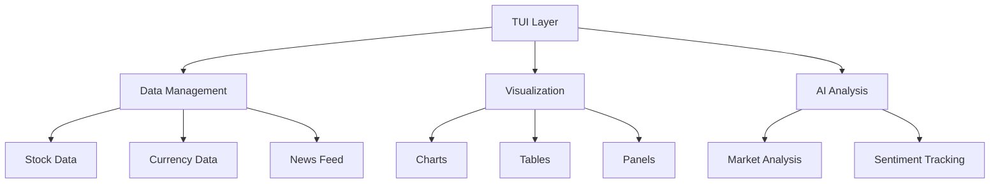

# MarketTerminal

TUI is a real-time vibes-based fincial analysis terminal combining technical analysis, sentiment tracking, and AI-powered market insights. Powered by the MarketAgents framework. 

## Overview

This project creates a vibes-based Terminal User Interface (TUI) for market analysis:

- Real-time stock price data
- Currency exchange rates
- News aggregation
- Technical analysis charts
- AI-powered market analysis
- Sentiment tracking

## Architecture



### Core Components

1. **FinancialDashboard (tui.py)**
   - Main interface controller
   - Handles user input and display updates
   - Manages real-time data streams
   - Coordinates AI analysis requests
   - The Tūī is a native bird of New Zealand, and inspired the name of the project

2. **FinancialSigns (tohu.py)**
   - Data acquisition and processing
   - Technical analysis generation
   - Chart rendering
   - News aggregation
   - 'tohu' can mean observing 'signs', 'to instruct', 'guide' etc

3. **Analysis System**
   - AI-powered market analysis
   - Sentiment tracking
   - Historical context integration
   - Risk assessment

## Features

- **Real-time Data Display**
  - Stock prices and changes
  - Currency exchange rates
  - Volume analysis
  - Market capitalization

- **Technical Analysis**
  - Price charts
  - Volume profiles
  - RSI indicators
  - MACD analysis

- **News Integration**
  - Multi-source news aggregation
  - Relevance filtering
  - Auto-scrolling display
  - Search functionality

- **AI Analysis**
  - Market sentiment analysis
  - Technical indicator interpretation
  - Risk factor identification
  - Trading recommendations

- **Sentiment Tracking**
  - Historical sentiment storage
  - Weighted averaging
  - Confidence scoring
  - Time-decay analysis

## Usage

1. Configure your market preferences in `config.yaml`:
   - Stock tickers
   - Currency pairs
   - News sources
   - Update frequencies

2. Run the terminal:
   ```bash
   python tui.py
   ```

3. Interface Controls:
   - `F`: Cycle focus between stocks
   - `P`: Change time period
   - `C`: Switch chart types
   - `M`: Change scroll mode
   - `A`: Toggle news awareness mode
   - `S`: Search functionality
   - `Q`: Quit application

## Configuration

The system is highly configurable through `config.yaml`:

- Market data sources
- Technical analysis parameters
- AI analysis settings
- Display preferences
- Update frequencies
- Sentiment tracking parameters

## Data Flow

1. Real-time data collection from multiple sources
2. Technical analysis computation
3. News aggregation and filtering
4. AI analysis generation
5. Sentiment tracking and updates
6. Display rendering and updates

## Dependencies

- Rich: Terminal UI framework
- yfinance: Market data
- Pandas: Data processing
- ollama: Local inference for structured outputs
- NumPy: Numerical computations
- CCXT: Cryptocurrency data (optional)
- Pydantic: Data validation

## Use Cases

- Real-time market monitoring
- Technical analysis visualization
- News impact assessment
- AI-powered market insights
- Sentiment trend tracking
- Trading decision support

## Notes

- Designed for terminal-based environments
- Focuses on real-time analysis and visualization
- Combines traditional technical analysis with AI insights
- Integrates multiple data sources for comprehensive analysis
- Provides configurable display and analysis options 

```bash
# Create new environment with Python 3.11
conda create -n financial-terminal python=3.11
conda activate financial-terminal

# Install dependencies
pip install -r requirements.txt
```


## Todo :

- Add social media sources
- Integrate MA Minference stack
- Enable better panel content management globally for scrolling and content dynamics
- Add concurrent analysis of multiple stocks and currencies rather than just the current focused one
- Test on Linux and Mac to ensure the input method is compatible (as it was developed on Windows)*
- pretty sure 'msvcrt' dependancy will break other platforms